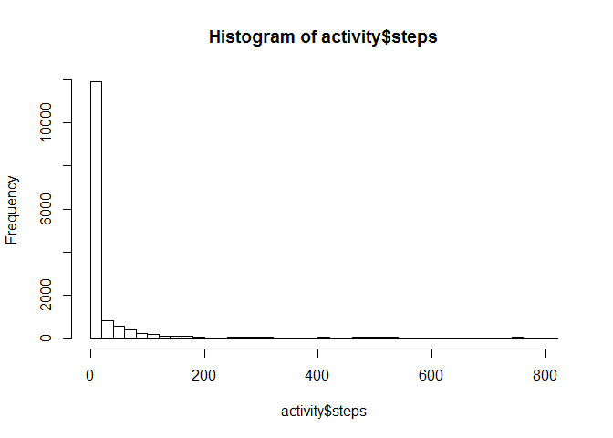
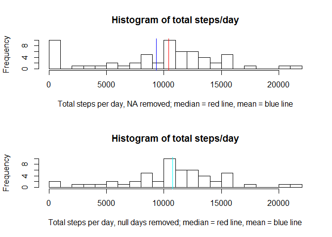
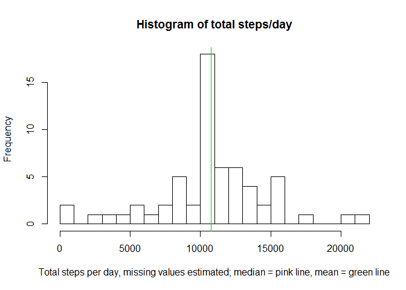

# Assigment 1 Reproducible Research - abigail2105
17 April 2015  

## Introduction:

It is now possible to collect a large amount of data about personal movement using activity monitoring devices such as a Fitbit, Nike Fuelband, or Jawbone Up. These type of devices are part of the "quantified self" movement - a group of enthusiasts who take measurements about themselves regularly to improve their health, to find patterns in their behavior, or because they are tech geeks. But these data remain under-utilized both because the raw data are hard to obtain and there is a lack of statistical methods and software for processing and interpreting the data.

This assignment makes use of data from a personal activity monitoring device. This device collects data at 5 minute intervals through out the day. The data consists of two months of data from an anonymous individual collected during the months of October and November, 2012 and include the number of steps taken in 5 minute intervals each day.

## Loading and preprocessing the data

The data for this assignment can be downloaded from the course web site:

    Dataset: Activity monitoring data [52K] 
    https://d396qusza40orc.cloudfront.net/repdata%2Fdata%2Factivity.zip

The data in .csv format were downloaded from this link to the working directory on 07/04/2017 at 10:28 WITA (GMT + 8) and extracted from the zip file within this directory.

The variables included in this dataset are:

    steps: Number of steps taking in a 5-minute interval (missing values are coded as NA)

    date: The date on which the measurement was taken in YYYY-MM-DD format

    interval: Identifier for the 5-minute interval in which measurement was taken

The dataset is stored in a comma-separated-value (CSV) file with a total of 17,568 observations in this dataset. The data were downloaded to the working directory, extracted from the zip file and loaded using the following code:


```r
# set working directory
wd <- "E:/Abigail/0 Reproducible Research/Assignment 1"
setwd(wd)
# note: to change the working directory for reproducing the analysis from a different computer/location it is sufficient to update the contents of "wd"" before running the code
```


```r
activity <- read.csv("activity.csv") # read data file which was downloaded, extracted and placed in working directory
class(activity)
```

```
## [1] "data.frame"
```

```r
summary(activity)
```

```
##      steps                date          interval     
##  Min.   :  0.00   2012-10-01:  288   Min.   :   0.0  
##  1st Qu.:  0.00   2012-10-02:  288   1st Qu.: 588.8  
##  Median :  0.00   2012-10-03:  288   Median :1177.5  
##  Mean   : 37.38   2012-10-04:  288   Mean   :1177.5  
##  3rd Qu.: 12.00   2012-10-05:  288   3rd Qu.:1766.2  
##  Max.   :806.00   2012-10-06:  288   Max.   :2355.0  
##  NA's   :2304     (Other)   :15840
```

```r
days <- levels(activity$date)
no.days <- length(days)
summary(activity$date)
```

```
## 2012-10-01 2012-10-02 2012-10-03 2012-10-04 2012-10-05 2012-10-06 
##        288        288        288        288        288        288 
## 2012-10-07 2012-10-08 2012-10-09 2012-10-10 2012-10-11 2012-10-12 
##        288        288        288        288        288        288 
## 2012-10-13 2012-10-14 2012-10-15 2012-10-16 2012-10-17 2012-10-18 
##        288        288        288        288        288        288 
## 2012-10-19 2012-10-20 2012-10-21 2012-10-22 2012-10-23 2012-10-24 
##        288        288        288        288        288        288 
## 2012-10-25 2012-10-26 2012-10-27 2012-10-28 2012-10-29 2012-10-30 
##        288        288        288        288        288        288 
## 2012-10-31 2012-11-01 2012-11-02 2012-11-03 2012-11-04 2012-11-05 
##        288        288        288        288        288        288 
## 2012-11-06 2012-11-07 2012-11-08 2012-11-09 2012-11-10 2012-11-11 
##        288        288        288        288        288        288 
## 2012-11-12 2012-11-13 2012-11-14 2012-11-15 2012-11-16 2012-11-17 
##        288        288        288        288        288        288 
## 2012-11-18 2012-11-19 2012-11-20 2012-11-21 2012-11-22 2012-11-23 
##        288        288        288        288        288        288 
## 2012-11-24 2012-11-25 2012-11-26 2012-11-27 2012-11-28 2012-11-29 
##        288        288        288        288        288        288 
## 2012-11-30 
##        288
```

```r
hist(activity$steps, 50) # long right tail
```

 
We can see that the data cover 61 days, with 288 intervals of 5 minutes in each day, which adds up to 24 hours (288*5/24 = 60).

The data are in the form of a data frame, a format which is suitable for further analysis. 

Steps per interval vary from 0 to 806. The step data are heavily skewed with a very long right tail.

Out of all these 17568 (61*288) intervals, 2304 are missing data (coded as NA). Before proceeding further it is necessary to adjust the data to account for or address the problem of missing data (NA values).This could be done using two approaches, both of which are applied in the following sections.

1. Remove NA values. This first approach is the simplest, as we simply remove the NA values. However this is not ideal as it results in uneven numbers of intervals, with many days not having 24 hours, and as the NAs could be at any time of day with any activity level this could result in significant bias.

2. Estimate the NA values. The second approach is more complex and is to estimate the values of the missing data based on the characteristics of the data provided in the data set. The values could be estimated in several ways, for example based on average values for the particular time of day (parameter "interval"), the day of the week (requires analysis to determine this additional parameter) or the date (parameter "date") of each entry with missing data. 

## What is the mean total number of steps taken per day?

Thi first section of the data analysis uses the remove missing (NA) step values approach. Using this approach several important parameters can be estimated, in particular 
      * the total number of steps per day per day (61 values), output to "totsteps1""
      * the mean of the total number of steps per day, ouput to "meansteps1"
      * the median of the total number of steps per day, output to "mediansteps1"
      
The analysis is rerun removing the days for which no steps at all were recorded, giving
      * the total number of steps per day per day (53 values), output to "totsteps2""
      * the mean of the total number of steps per day, ouput to "meansteps2"
      * the median of the total number of steps per day, output to "mediansteps2"


```r
fun1 <- function (x) {
      actdat <- activity[activity[,2] == x,1]
      actval <- sum(actdat, na.rm = TRUE)
}  
# this function extracts the sum of the steps for a given day "x"
totsteps1 <- c(sapply(days, fun1)) # applies fun1 to all 61 days
summary(totsteps1)
```

```
##    Min. 1st Qu.  Median    Mean 3rd Qu.    Max. 
##       0    6778   10400    9354   12810   21190
```

```r
totsteps2 <- totsteps1[totsteps1 > 0] # this removes the days with no data
summary (totsteps2)
```

```
##    Min. 1st Qu.  Median    Mean 3rd Qu.    Max. 
##      41    8841   10760   10770   13290   21190
```

```r
meansteps1 <- mean(totsteps1)
meansteps1
```

```
## [1] 9354.23
```

```r
mediansteps1 <- median(totsteps1)
mediansteps1
```

```
## [1] 10395
```

```r
meansteps2 <- mean(totsteps2)
meansteps2
```

```
## [1] 10766.19
```

```r
mediansteps2 <- median(totsteps2)
mediansteps2
```

```
## [1] 10765
```

```r
nulldays <- length(totsteps1) - length(totsteps2)
nulldays
```

```
## [1] 8
```


As shown above, the mean and median are actually contained in the summary statistics for totsteps1 and totsteps2. The mean and median are very close for totsteps2, after the missing values have been removed. 
Using this NA removal approach, the mean number of steps per day is 10766 and the median number is 10765.

## What is the average daily activity pattern?

A histogram of the distribution of the estimated total number of steps per day (the total number recorded in the data set) can be produced using the following code


```r
par(mfcol = c(2,1))

hist(totsteps1,20, main = "Histogram of total steps/day", xlab = "Total steps per day, NA removed; median = red line, mean = blue line")
abline(v = mediansteps1, col = 2) # red
abline (v = meansteps1, col = 4) # blue

hist(totsteps2,20, main = "Histogram of total steps/day", xlab = "Total steps per day, null days removed; median = red line, mean = blue line")
abline(v = mediansteps2, col = 3) # green
abline (v = meansteps2, col = 5) # turquoise
```

 

It is clear from this plot that the majority of the data are in fact approximately normally distributed apart from the quite large number of null values in totsteps1, which are removed in totsteps2. 

## Inputting missing values

In this section of the analyses, the missing data are estimated and the above analysis is then rerun with the estimated values included. Further analyses are also run, in order to explore daily activity pattern(s).

The total number of rows with missing step data to be estimated is 2304, obtained from the summary of the data (summary(activity)) table above. 

The strategy selected for filling in the missing data was to use the mean of the data for each 5 minute interval. This was chosen in preference to using data on the day in question as for some days there are no intervals with data (e.g. the first day).

The code used was:


```r
actnew <- activity # create a copy of the data set
x <- c(1:17568) # vector to index the observations
fun2 <- function (x) {
      
      if (is.na(actnew[x,1])) {
            int <- (actnew[x,3])
            st <- actnew[(actnew[,3] == int),1]
            avg <- mean(st, na.rm = T)
      }
      else avg <- actnew[x,1]}
# function to return average of existing values for NA step values (the if routine) and original data values if they exist (else line) 
   
newsteps <- round(sapply(x, fun2)) # creates a vector of steps with integer missing values filled in
summary(newsteps)
```

```
##    Min. 1st Qu.  Median    Mean 3rd Qu.    Max. 
##    0.00    0.00    0.00   37.38   27.00  806.00
```

```r
act <- cbind(newsteps,activity) # merges the new (infilled) step data with the data in the original data frame
summary(act) # gives a summary of the new and old data
```

```
##     newsteps          steps                date          interval     
##  Min.   :  0.00   Min.   :  0.00   2012-10-01:  288   Min.   :   0.0  
##  1st Qu.:  0.00   1st Qu.:  0.00   2012-10-02:  288   1st Qu.: 588.8  
##  Median :  0.00   Median :  0.00   2012-10-03:  288   Median :1177.5  
##  Mean   : 37.38   Mean   : 37.38   2012-10-04:  288   Mean   :1177.5  
##  3rd Qu.: 27.00   3rd Qu.: 12.00   2012-10-05:  288   3rd Qu.:1766.2  
##  Max.   :806.00   Max.   :806.00   2012-10-06:  288   Max.   :2355.0  
##                   NA's   :2304     (Other)   :15840
```

Now we cam repeat the analysis in part 1 using the following code:


```r
fun3 <- function (x) {
      actdat3 <- act[act[,3] == x,1]
      actval3 <- sum(actdat3)
}  
# this function extracts the sum of the steps for a given day "x"
totsteps3 <- c(sapply(days, fun3)) # applies fun3 to all 61 days
summary(totsteps3)
```

```
##    Min. 1st Qu.  Median    Mean 3rd Qu.    Max. 
##      41    9819   10760   10770   12810   21190
```

```r
meansteps3 <- mean(totsteps3)
meansteps3
```

```
## [1] 10765.64
```

```r
mediansteps3 <- median(totsteps3)
mediansteps3
```

```
## [1] 10762
```

```r
hist(totsteps3,20, main = "Histogram of total steps/day", xlab = "Total steps per day, missing values estimated; median = pink line, mean = green line")
abline(v = mediansteps3, col = 7) # pink
abline (v = meansteps3, col = 3) # green
```

 

From the results above it can be seen that replacing NA entries with estimated entries (mean per interval) results in very similar mean and median values compared to removing all the NA values. However the shape of the distribution differs markedly, with a much sharper peak. Comparing the summary results, it can be seen that this is reflected in the quartiles where the interquartile range is much narrower.


## Are there differences in activity patterns between weekdays and weekends?

To carry out this analysis, it is necessary to work out the days of the week for the data set.
This was done using the following code.


```r
actdates <- activity[,2] # extract the dates
actdates <- as.Date(actdates, format="%Y-%m-%d") # convert from factor to date format
wdays <- weekdays(actdates) # change to days of the week
wdays <- gsub("Minggu", "weekend", wdays) # Sunday in Indonesian"
wdays <- gsub("Sabtu", "weekend", wdays) # Saturday in Indonesian
wdays <- gsub("Senin", "weekday", wdays) # Monday in Indonesian
wdays <- gsub("Selasa", "weekday", wdays) # Tuesday in Indonesian
wdays <- gsub("Rabu", "weekday", wdays) # Wednesday in Indonesian
wdays <- gsub("Kamis", "weekday", wdays) # Thursday in Indonesian
wdays <- gsub("Jumat", "weekday", wdays) # Friday in Indonesian
table(wdays) # verify wdays now converted to weekend and weekdays
```

```
## wdays
## weekday weekend 
##   12960    4608
```

```r
actdat <- cbind(act,wdays) # bind to the data frame with the in-filled data set
```

With this data frame, it is now possible to compare the average steps taken by 5 minute time interval over 24 hours between weekdays and weekends. This was done using the following code


```r
wkdat <- actdat[actdat$wdays == "weekday",] # weekday data
wedat <- actdat[actdat$wdays == "weekend",] #weekend data
wkdat <- wkdat[,c(1,4)] # select infilled steps and interval
wedat <- wedat[,c(1,4)]  # select infilled steps and interval
summary(wkdat)
```

```
##     newsteps         interval     
##  Min.   :  0.00   Min.   :   0.0  
##  1st Qu.:  0.00   1st Qu.: 588.8  
##  Median :  0.00   Median :1177.5  
##  Mean   : 35.61   Mean   :1177.5  
##  3rd Qu.: 24.00   3rd Qu.:1766.2  
##  Max.   :806.00   Max.   :2355.0
```

```r
summary(wedat)
```

```
##     newsteps         interval     
##  Min.   :  0.00   Min.   :   0.0  
##  1st Qu.:  0.00   1st Qu.: 588.8  
##  Median :  0.00   Median :1177.5  
##  Mean   : 42.36   Mean   :1177.5  
##  3rd Qu.: 35.00   3rd Qu.:1766.2  
##  Max.   :785.00   Max.   :2355.0
```

```r
ints <- levels(as.factor(activity$interval)) # vector of intervals
ints <- as.integer(ints) # convert to integer
x <- c(1:length(ints)) # counts for functions
fun5 <- function (x) {
      stps <- wkdat[wkdat[,2] == ints[x],1]
      val <- mean(stps)
}
wksteps <- sapply(x, fun5) # produces average steps/interval for weekdays
fun6 <- function (x) {
      stps <- wedat[wedat[,2] == ints[x],1]
      val <- mean(stps)
}
westeps <- sapply(x, fun6)

par(mfcol = c(2,1))

plot(ints,wksteps, type = "l", main = "Average number of steps/5 minutes over 24 hrs during weekdays", xlab = "time interval", ylab = "average number of steps")

plot(ints,westeps, type = "l", main = "Average number of steps/5 minutes over 24 hrs during weekends", xlab = "time interval", ylab = "average number of steps")
```

 

Comparing the plots of weekday and weekend activity, it seems that the subject was more active early in the morining on weekdays, and more active in the middle of the day and in the evenings at weekends. The peak in walking activity is around mid-morning on both weekdays and weekends. Total steps taken and avergae steps per 5 minutes tend to be higher at weekends. However the highest peak activity occurred during a weekday.

## Conclusion:

Overall, the data show that activity (steps) varies considerably between days and time of day, however the average number of steps taken per day is around 10,766, and the average steps per 5 minutes is around 37. Confidence intervals could be calculated for steps per day using a normal approximation, as the distribution is approximately normal and the sample size (61 days) is over 30. 

Average figures are similar using the two methods for addressing missing data (remove NA records or use average per 5 minute interval). However the latter method gives a smaller spread (sharper peak).

The data also show that on average more steps per day are taken at weekend. Weekend activity tends to begin later, be more spread out during the day and continue until later at night.
